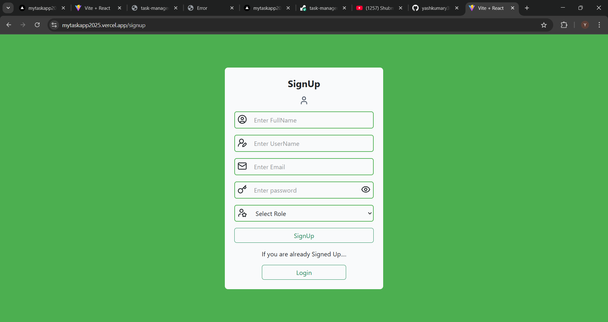
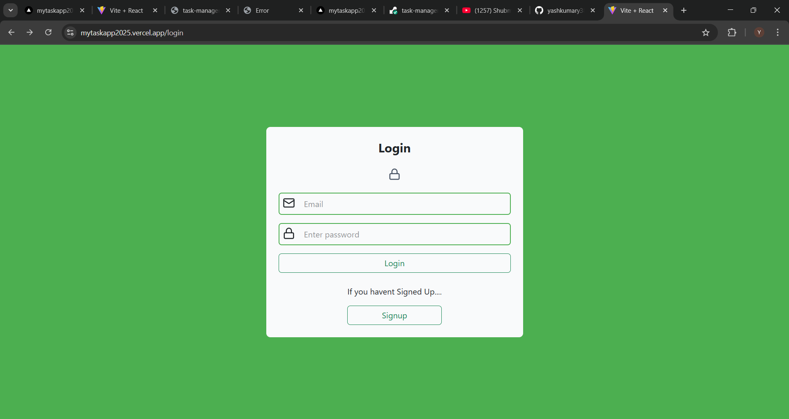
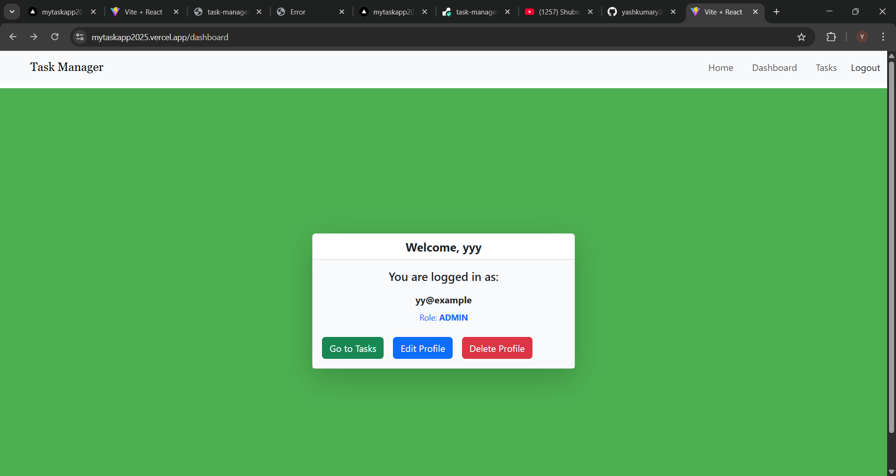
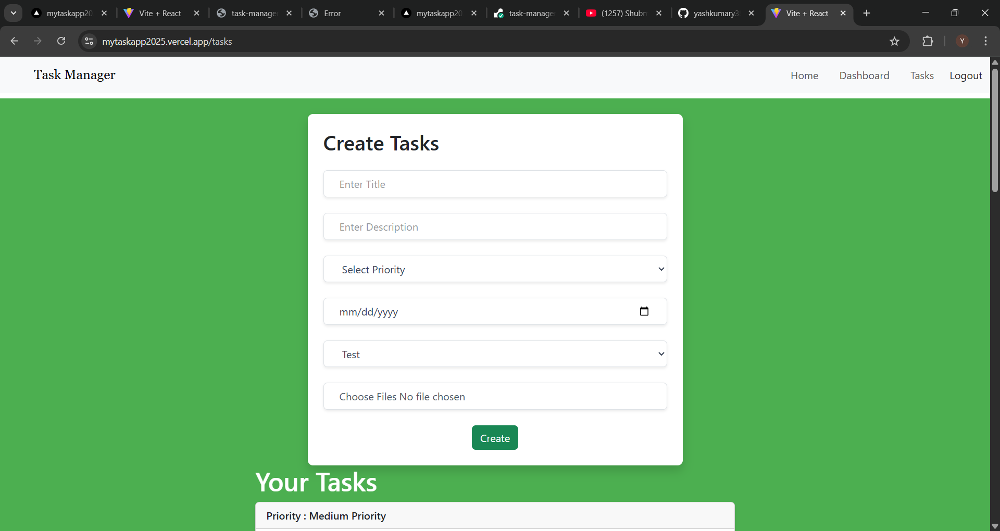

# ✅ Task Manager App (MERN Stack)

This is a fullstack task management application built with the **MERN stack**. It allows users to manage tasks through a RESTful API and a responsive frontend UI.

---

## 🛠 Tech Stack

- **Frontend:** React (Vite)
- **Backend:** Node.js, Express
- **Database:** MongoDB
- **ORM:** Mongoose

---

## 🚀 Deployment

- **Backend:** Deployed on [Render](https://task-manager-backend-zz8q.onrender.com)
- **Frontend:** Deployed on [Vercel](https://mytaskapp2025.vercel.app/)

---

## 📁 Project Structure
task-manager-fullstack/
├── backend/ ─ Node.js + Express backend
│   ├── controllers/ ─ Route logic
│   ├── middlewares/ ─ Auth and error handling
│   ├── models/ ─ Mongoose models
│   ├── routes/ ─ API endpoints
│   ├── uploads/ ─ File storage (e.g., multer)
│   └── docs/ ─ API documentation (Markdown / Swagger)
├── .env ─ Environment variables
├── index.js ─ Entry point
├── frontend/ ─ Vite + React frontend
│   ├── src/ ─ React components and pages
│   ├── public/ ─ Static assets
│   └── vite.config.js ─ Vite config
└── README.md ─ Project documentation

---

## 📄 API Documentation

You can find the complete API documentation for the backend inside the `/backend/docs/` folder.

It includes all available endpoints, HTTP methods, request/response formats, and authentication details.

## 📸 Screenshots

---

### ✅ Sign Up

### 🔐 Login Page

---

### 🧾 Dashboard View

---

### ✅ Create Task

